Внимание, прочтите условия лицензии прежде чем открывать файлы: https://github.com/apukhaevaa/hw_tg/blob/main/LICENSE

# Telegram Bot (@FitVoice_bot) & Flask API with Docker Integration into Server

## Описание проекта

Данный проект состоит из двух основных компонентов:

1. **Телеграм-бот (`async_TGbot.py`)**  

   Телеграм-бот предназначен для помощи пользователям в ежедневном отслеживании активности. Основные функции:

   - Логирование потребления воды 💧.

   - Отслеживание потребления пищи 🍏.

   - Мониторинг тренировок 🏃.

   - Расчет норм воды и калорий.

   - Распознавание эмоций по отправленным фотографиям 😃 с предоставлением рекомендаций по активности.
     
   - Общение с ChatGPT для получения более продвинутой информации по калорийности пищи, а также разработка планов тренировок.

   Бот разработан с использованием библиотеки `python-telegram-bot` и интегрирует внешние API, такие как OpenWeather для получения данных о погоде.

1. **Flask API (`api_FER.py`)**  

   Легкий сервер на Flask, который выполняет роль backend для распознавания эмоций.  

   - Использует библиотеку `FER` для анализа эмоций на загруженных изображениях.

   - Возвращает JSON-ответ с результатами распознавания.

---

## Функционал

### Телеграм-бот

- **Настройка профиля**: Пользователь указывает вес, рост, возраст, уровень активности и город.

- **Логирование воды**: Ведение учета выпитой воды и расчёт оставшейся нормы.

- **Логирование пищи**: Рассчитывает калорийность указанных продуктов.

- **Логирование тренировок**: Учет времени тренировок и сожженных калорий.

- - **Проверка прогресса**: Сводная информация по воде и калориям.

- **Отображение прогресса**: Создание графиков по воде и калориям.

- **Распознавание эмоций**: Пользователь может отправить фото, а бот предоставит рекомендации по активности на основе распознанных эмоций.

- **Интеграция с ChatGPT**: Рекомендации учитывают текущие погодные условия.

### Flask API

- **Распознавание эмоций**: Анализирует изображения и возвращает вероятности эмоций (например, радость, грусть, злость).

- **Обработка изображений**: Конвертация изображений в RGB для дальнейшего анализа.

---

## Что было сделано

### Разработка

1. **Телеграм-бот**:

   - Реализованы все основные и все дополнительные команды, такие как настройка профиля, логирование данных, отображение прогресса, вывод рекомендаций, более продвинутые расчеты.

   - Добавлена интеграция с внешними API (OpenWeather, Nutritionix).

   - Подключено распознавание эмоций через Flask API.

2. **Flask API**:

   - Реализован сервер Flask для распознавания эмоций с использованием `FER`.

   - Настроен механизм обработки изображений (скачивание, конвертация и анализ).

   - Открыт REST API для взаимодействия с Телеграм-ботом.

### Dockerизация

1. **Docker-образы**:

   - Созданы два отдельных контейнера:

     - Первый для Телеграм-бота.

     - Второй для Flask API.

   - Каждый контейнер содержит свой `Dockerfile`.

2. **Настройка сети**:

   - Настроена сеть Docker для связи между контейнерами.

   - Обновлен код Телеграм-бота для использования Flask API через внутреннюю сеть Docker.

3. **Docker Compose**:

   - Написан `docker-compose.yml` для одновременного запуска обоих контейнеров.

   - Упрощено развертывание системы.

### Развертывание

1. **Сервер**:

   - Проект развернут на удаленном сервере с Ubuntu 24.04.

   - Установлены Docker и Docker Compose.

   - Настроен SSH-доступ с использованием пары ключей для безопасного соединения.

2. **Управление контейнерами**:

   - Контейнеры успешно развернуты и работают в связке.

   - Проверено взаимодействие между Телеграм-ботом и Flask API.

---

## Структура файлов

- **`async_TGbot.py`**: Основной файл Телеграм-бота с логикой команд и обработчиков.

- **`api_FER.py`**: Flask API для распознавания эмоций.

- **`requirements.txt`**: Список необходимых зависимостей.

- **`Dockerfile`** (для каждого сервиса):

  - Указывает базовый образ, рабочую директорию, зависимости и команды запуска.

- **`docker-compose.yml`**:

  - Автоматизирует запуск обоих контейнеров и настраивает их взаимодействие.

- **README.md**: Текущее описание проекта.

---

## Идеи для будущего улучшения

- Добавить аутентификацию пользователей для большей персонализации.

- Расширить аналитические функции для отслеживания прогресса.

- Добавить более детализированные рекомендации на основе эмоций.

**Рисунок 1. Сбор Докер образа для основного файла телеграм бота @FitVoice_bot - async_TGbot.py**

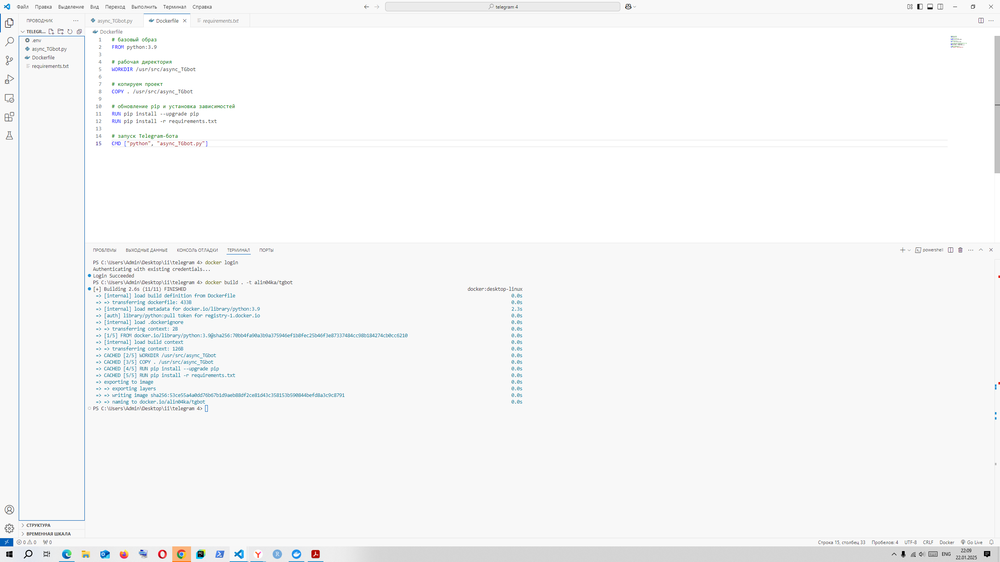

**Рисунок 2. Интеграция Докер образа в Docker Hub для основного файла телеграм бота @FitVoice_bot - async_TGbot.py** 

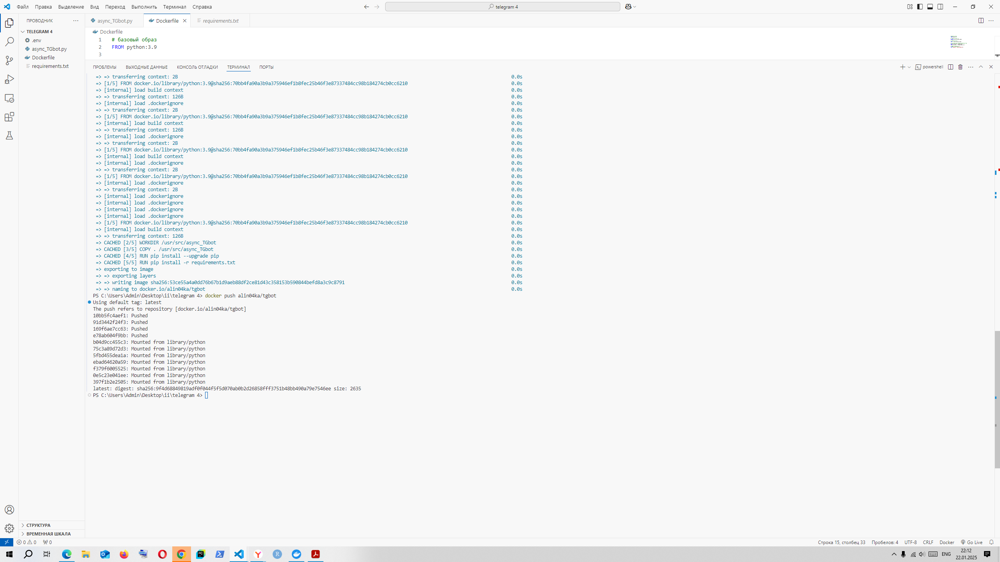

**Рисунок 3. Докер образа в Docker Hub для основного файла телеграм бота @FitVoice_bot - async_TGbot.py** 

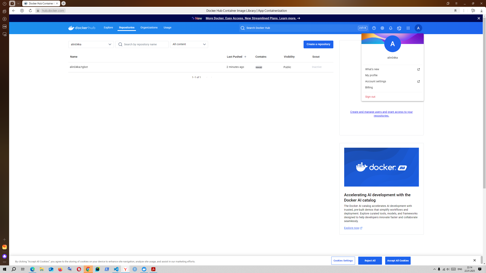

**Рисунок 4. Деплой Докер контейнера на сервер Sugar (Selectel) для основного файла телеграм бота @FitVoice_bot - async_TGbot.py** 

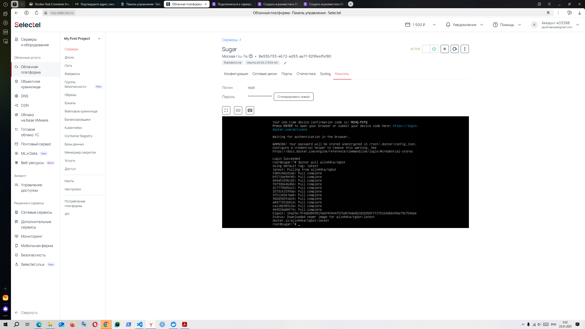

**Рисунок 5. Проверка Докер образа на сервере Sugar (Selectel) для основного файла телеграм бота @FitVoice_bot - async_TGbot.py** 
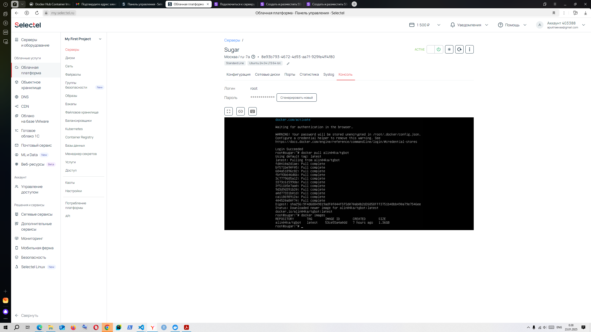

**Рисунок 6. Проверка логов Докер образа на сервере Sugar (Selectel) для основного файла телеграм бота @FitVoice_bot - async_TGbot.py** 

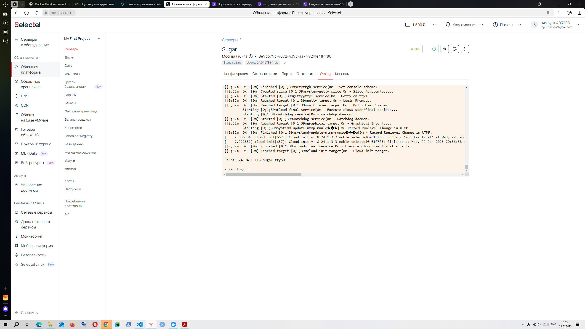

**Рисунок 7. Локальный запуск основного файла телеграм бота @FitVoice_bot - async_TGbot.py** 

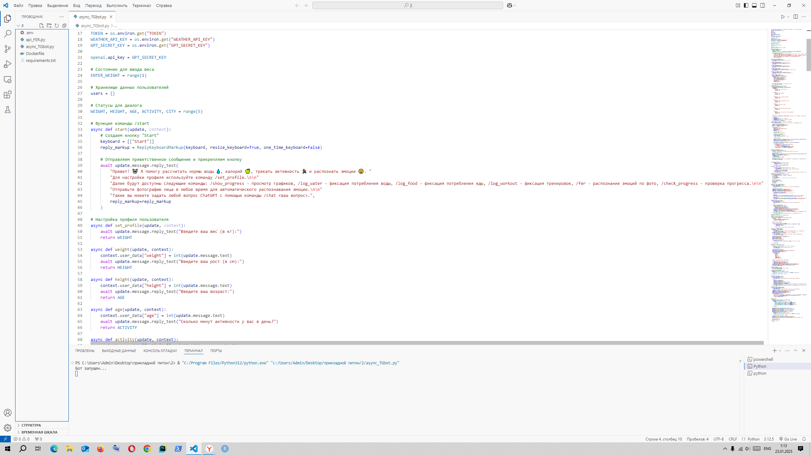

**Рисунок 8. Локальный запуск Flask API телеграм бота @FitVoice_bot - api_FER.py** 

**Рисунок 9. Реализация кнопки /start телеграм бота @FitVoice_bot** 

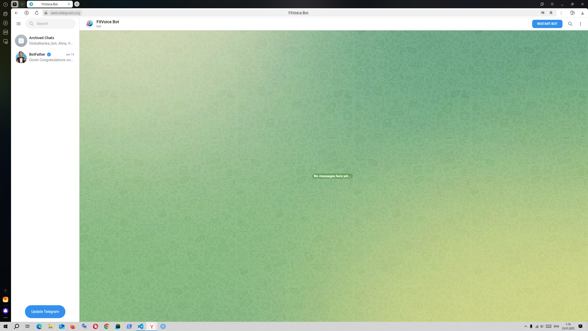

**Рисунок 10. Реализация кнопки /start телеграм бота @FitVoice_bot**  

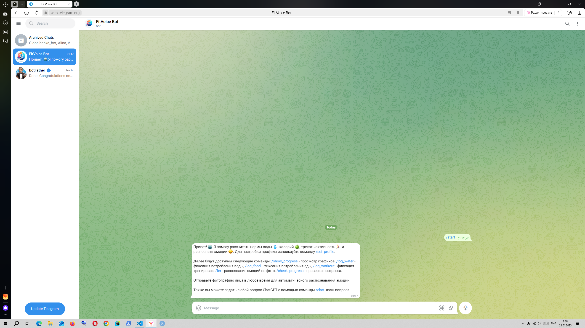

**Рисунок 11. Реализация кнопки /set_profile телеграм бота @FitVoice_bot** 

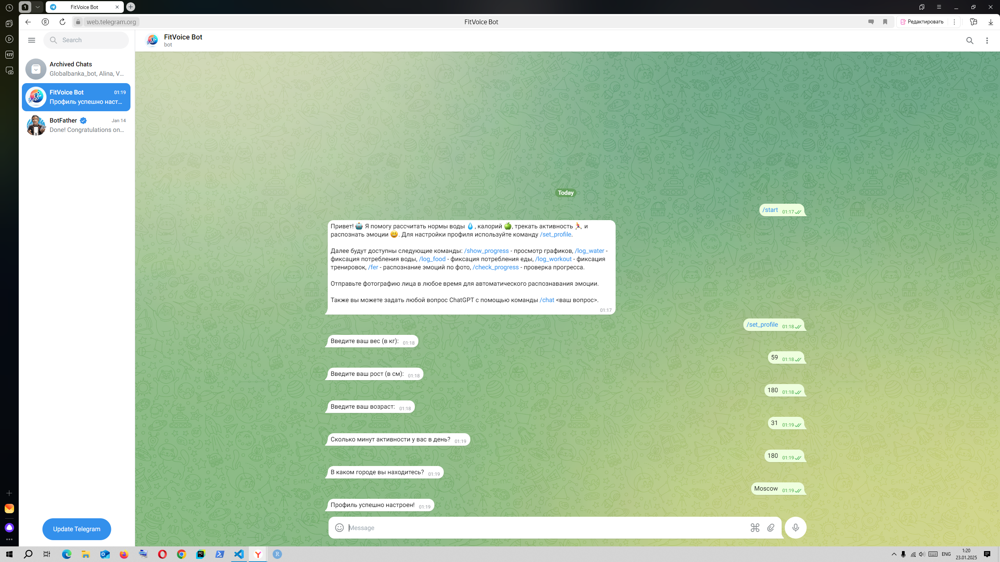

**Рисунок 12. Реализация кнопки /log_water, /log_food, /log_workout телеграм бота @FitVoice_bot** 

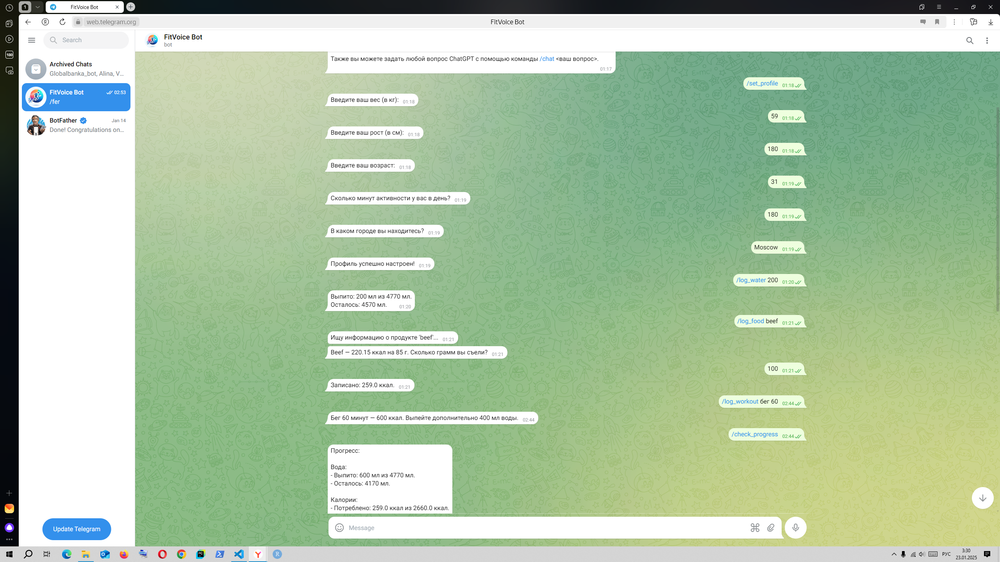

**Рисунок 13. Реализация кнопки /check_progress, /show_progress телеграм бота @FitVoice_bot** 

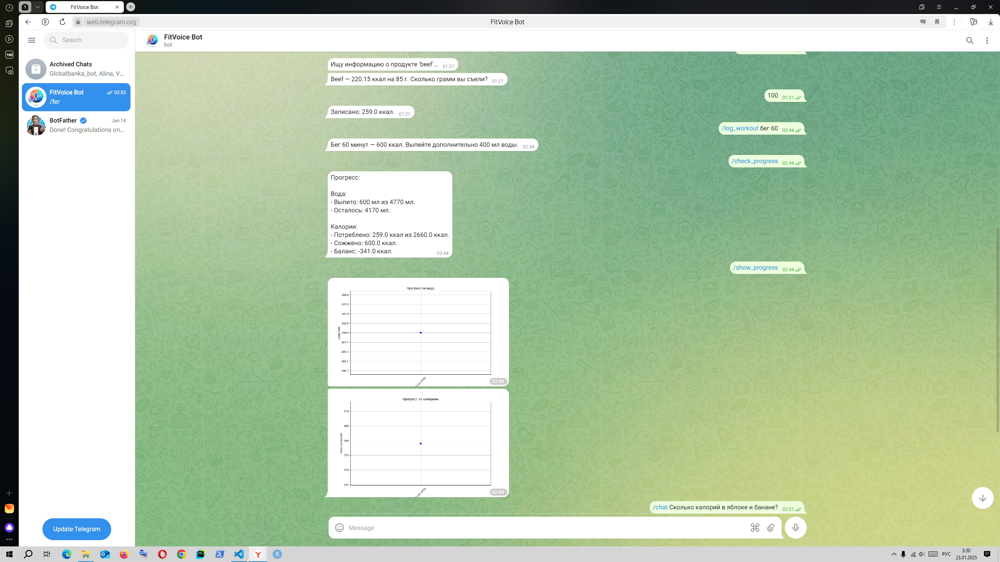

**Рисунок 14. Реализация кнопки /chat (общение с ChatGPT для более продвинутого определения калорийности продуктов, выстраивания плана тренировок и т.д.) телеграм бота @FitVoice_bot** 

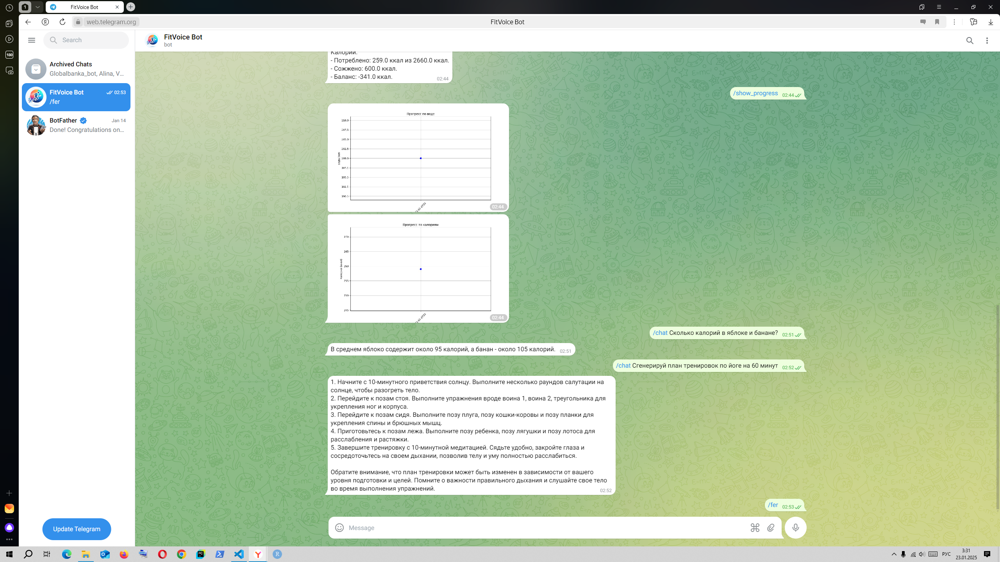

**Рисунок 15. Реализация кнопки /fer (распознание эмоций по фото и предложение рекомендаций) телеграм бота @FitVoice_bot** 

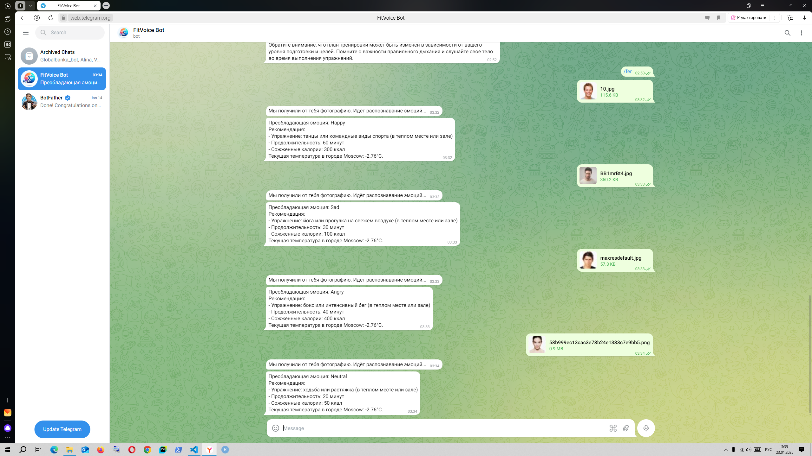

